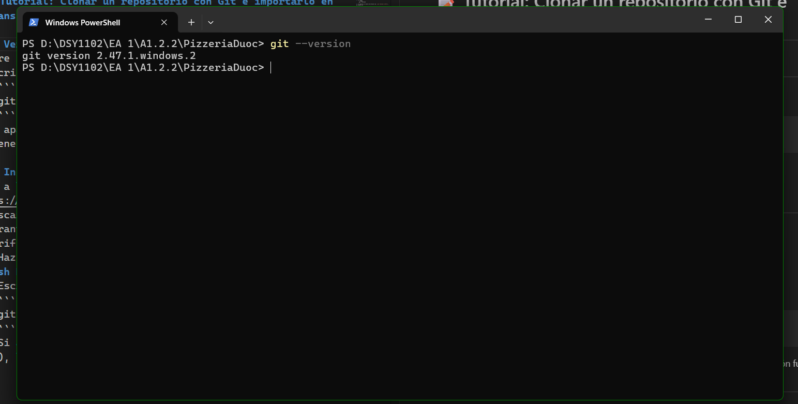
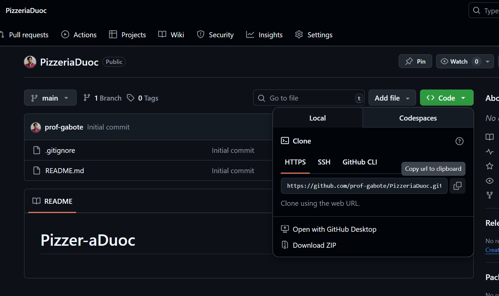
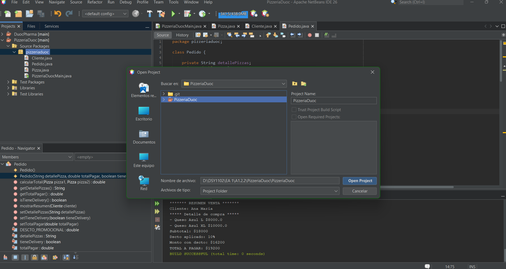

# 📝 Tutorial: Clonar un repositorio con Git e importarlo en NetBeans (Windows)

## 1. Verifica que tienes Git instalado
1. Abre una terminal, CMD o Windows PowerShell.
2. Escribe:  
     ```bash
     git --version
     ```  
3. Si aparece un número de versión (ej: `git version 2.44.0`), ya tienes Git


## 2. Instalar Git (Si no lo tienes)
1. Ir a la página oficial: [https://git-scm.com/downloads](https://git-scm.com/downloads)  
2. Descargar la versión para **Windows**. 
3. Durante la instalación, dejar las opciones por defecto.  
4. Verificar la instalación:
   - Abre una terminal, CMD o Windows PowerShell.
   - Escribe:  
     ```bash
     git --version
     ```  
   - Si aparece un número de versión (ej: `git version 2.44.0`), la instalación fue correcta.

---

## 3. Crear una cuenta en GitHub (opcional)
- Regístrate en [https://github.com/](https://github.com/).  
- Si ya tienes la URL del repositorio que quieres clonar, este paso no es necesario.

---

## 3. Clonar un repositorio
1. Crea o busca la carpeta donde quieras guardar el proyecto (ejemplo: `Documentos/NetBeansProjects`).  
2. Haz **clic derecho** dentro de la carpeta y selecciona:  
   - **Git Bash Here** (o **Abrir en Terminal** en Windows 11).
   
3. Copia la URL del repositorio desde GitHub, en este caso es:

    > https://github.com/prof-gabote/PizzeriaDuoc.git

    

4. En la terminal escribe:  
    ```bash
    git clone https://github.com/prof-gabote/PizzeriaDuoc.git
    ```
    Esto descargará el proyecto dentro de la carpeta como una nueva subcarpeta llamada proyecto-ejemplo.

## 4. Abrir el proyecto en NetBeans

- Abre Apache NetBeans.

- Ve a File > Open Project (Archivo > Abrir Proyecto).

- Busca la carpeta proyecto-ejemplo que clonaste.

- Haz clic en Open Project.

